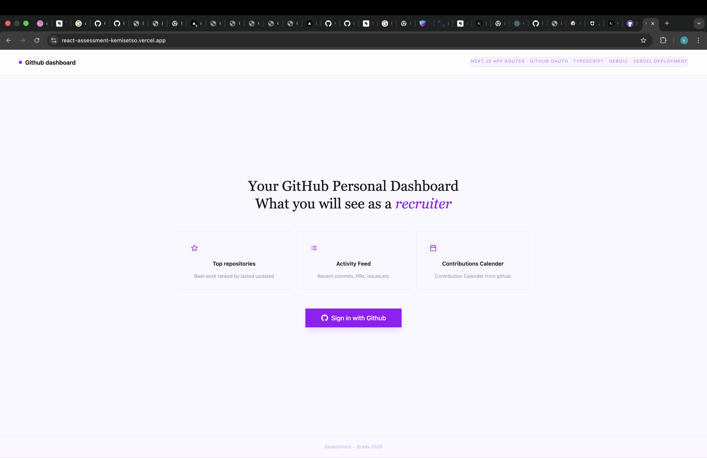
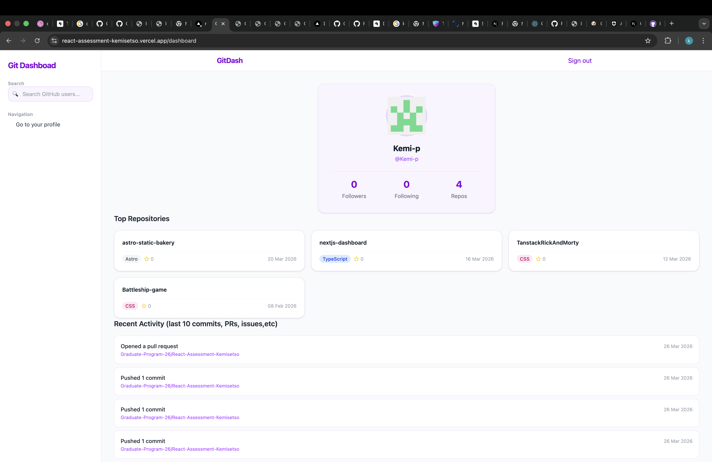
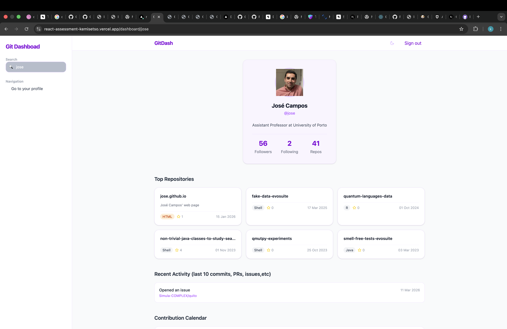

Here's a **professional and updated README.md** tailored for your **development branch**, which contains all the latest changes.

You can copy-paste this directly into your `README.md` file (it will replace the default Next.js one).

````markdown
# React Assessment - Kemisetso

A modern **Next.js** web application built with TypeScript, Tailwind CSS, and the App Router. This project is part of a graduate program assessment and represents the latest development work.

**Live Demo**: [https://react-assessment-kemisetso.vercel.app](https://react-assessment-kemisetso.vercel.app)

---

## Screenshots





---

## Features

- **Next.js 15** with App Router
- **TypeScript** for type safety
- **Tailwind CSS and HeroUI** for styling
- Modern UI components in `/app/ui`
- Authentication logic (`auth.ts`)
- Dashboard route (`/dashboard`)
- API routes (`/app/api`)
- Shared utilities (`/app/lib`), types (`/app/types`), and providers
- Responsive design with Geist font
- ESLint + Prettier + Husky for code quality
- 404 error page with custom illustration

---

## Tech Stack

- **Framework**: Next.js (App Router)
- **Language**: TypeScript
- **Styling**: Tailwind CSS + PostCSS
- **Font**: Geist (optimized)
- **Linting/Formatting**: ESLint, Prettier
- **Git Hooks**: Husky
- **Package Manager**: npm

---

## Links to docs and extras used

- https://authjs.dev/reference/nextjs
- https://heroui.com/docs/react/components/chip
- https://nextjs.org/docs/app/getting-started/proxy
- https://nextjs.org/learn/dashboard-app/adding-authentication
- https://react-icons.github.io/react-icons/search/#q=github
- https://vercel.com/docs/git
- https://next-auth.js.org/getting-started/typescript
- https://www.npmjs.com/package/next-themes
- https://stackoverflow.com/questions/27732209/turning-off-an-eslint-rule-for-a-specific-line
- https://www.npmjs.com/package/react-github-calendar
- https://typicode.github.io/husky/get-started.html
- https://auth0.com/docs/secure/tokens/access-tokens
- https://nextjs.org/docs/pages/guides/authentication
- https://docs.github.com/en/apps/oauth-apps/building-oauth-apps/creating-an-oauth-app
- https://authjs.dev/getting-started/providers/github
- https://docs.github.com/en/rest/users
- https://docs.github.com/en/rest/repos/repos
- https://docs.github.com/en/rest/activity/events
- https://nextjs.org/docs/app/building-your-application/authentication
- https://vercel.com/docs/deployments
- https://docs.github.com/en/rest/search/search?apiVersion=2026-03-10

---

## Project Structure

```bash
├── app/
│   ├── api/              # API routes
│   ├── dashboard/        # Dashboard pages & components
│   ├── lib/              # Utility functions
│   ├── types/            # TypeScript type definitions
│   ├── ui/               # Reusable UI components
│   ├── auth.ts           # Authentication logic
│   ├── globals.css       # Global styles
│   ├── layout.tsx        # Root layout
│   ├── page.tsx          # Home/Landing page
│   ├── providers.tsx     # Context & providers
│   └── not-found.tsx     # Custom 404 page
├── public/
│   └── 404.svg           # Custom 404 illustration
├── next.config.ts
├── tsconfig.json
├── tailwind.config.js
└── package.json
```
````

---

## Getting Started

### Prerequisites

- Node.js 18+ (or Bun)
- npm / yarn / pnpm / bun

### Installation

```bash
# Clone the repository
git clone https://github.com/Graduate-Program-26/React-Assessment-Kemisetso.git
cd React-Assessment-Kemisetso

# Switch to development branch (latest changes)
git checkout development

# Install dependencies
npm install
# or
bun install
```

### Running the Development Server

```bash
npm run dev
# or
bun dev
```

Open [http://localhost:3000](http://localhost:3000) to view the app.

---

## Deployment

The project is optimized for deployment on **Vercel**:

[](https://vercel.com/new/clone?repository-url=https%3A%2F%2Fgithub.com%2FGraduate-Program-26%2FReact-Assessment-Kemisetso&branch=development)

-
